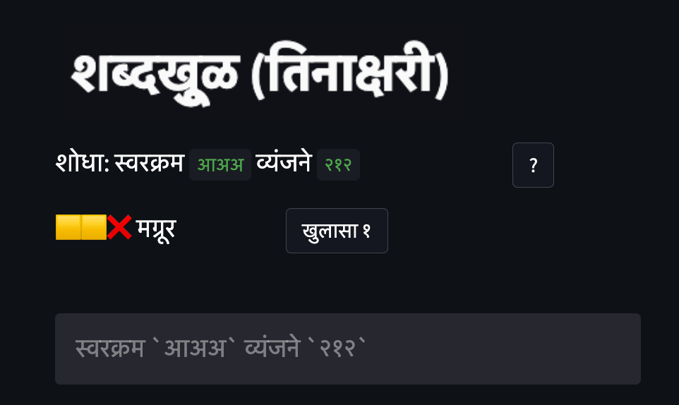

# शब्दखूुळ
आशिष महाबळ

कधीकधी एखादं भुत जगातल्या अनेकांच्या  मानगुटींवर (की मनांवर) एकदम बसतं, जगाला पछाडून टाकतं.  तसंच काहीसं जॉश वॉर्डलनी बनवलेल्या वर्डलनी झालं. पाच अक्षरी इंग्रजी शब्द  ओळखण्याचा हा साधा खेळ.   सहा खेळ्यांमध्ये गुप्तशब्द ओळखायचा.  प्रत्येक प्रयत्नानंतर  तुमच्या अक्षरांपैकी किती बरोबर आहेत याबद्दलची माहिती मिळते. खरं तर त्याच्या साधेपणामुळेच तो पुर्ण जगाला आपल्या कह्यात घेऊ शकला.  त्याने म्हणे तो आपल्या गर्लफ्रेंड करता लिहिला. तिचं प्रेझेंट मागवायला वेळ न मिळाल्यामुळे.  खेळातील यादीत तेवीसशे गुप्तशब्द आहे. गुप्त कसले, ओपन सिक्रेट आहेत ते. संगणकाच्या माऊसची उजवी कळ दाबून पूर्ण सोर्स कोड मिळवता येतो. त्यात ती यादी देखील आहे. पण अशी यादी मिळवून शब्द ओळखण्यात मजा  नाही.  रोज मध्यरात्री आपोआप नवा शब्द शोधायची संधी मिळते.  लोकांमध्ये किती कमी खेळ्यांमध्ये तो शब्द  शोधता आला याबद्दल चढाओढी लागतात. नोव्हेंबरच्या सुरुवातीपर्यंत म्हणजे तो खेळ रिलीज झाल्यानंतर शंभरपेक्षा अधिक दिवस साधारण शंभर एक लोकांनीच तो खेळला होता.  आजचे युग  व्हायरसचं आहे हेच खरं. त्यानंतर वर्डल जो व्हायरल झाला त्याला तोड नाही. कोट्यावधी लोक तो खेळू लागले.  न्यु यॉर्क टाइम्सने तो दहा लाखांपेक्षा अधिक अमेरिकन डॉलर्सना विकत घेतला. जॉश वॉर्डलनी  याआधी पण दोन वायरल गोष्टी जगाला दिल्या होत्या.  रेडीट वरती एका वेळी एक पिक्सल डकवायची एक जागा आणि साठ पासून एक पर्यंत सेकंदागणीक काऊंटडाऊन करणारं एक घड्याळ जे एका मिनिटाऐवजी दोन महिने सुरू होतं.

अशा गोष्टींमुळे अनेकांची डोकी वेगवेगळ्या प्रकारे चालू लागतात.  अनेक बहाद्दरांनी वेगवेगळ्या प्रकारचे प्रोग्राम्स लिहिले.  पहिला गेस कोणत्या शब्दांनी करावा याबद्दल काही होते.  तर पहिला शब्द दिल्यानंतर त्याला जे गुण मिळतात त्यानंतर आपण कोणता वापरायचा त्याकरता काही लोकांनी प्रोग्राम लिहिले.  खरंतर या प्रकारचे प्रोग्रॅम आधीही लिहिले गेले आहेत.  वर्डल शब्दांकरता आहे. तसाच पण पूर्णपणे  ऍबस्ट्रॅक्ट आणि केवळ रंगांचा असा मास्टरमाईंड हा खेळ अनेक वर्षे उपलब्ध आहे. शब्दांच्या या खेळावर मात्र अनेक स्पिन ऑफ्स शक्य होते आणि लोकांनी त्याचा पुरेपूर फायदा घेतला.  मला आवडलेला असा एक प्रोग्राम म्हणजे ॲबसर्डल.  यात एक प्रकारे तो खेळ तुमच्याविरुद्ध कारस्थान करत असतो.  तुम्ही निवडलेल्या शब्दाला कमीत कमी गुण देऊन शब्द बदलत पण आधीच्या सर्व गुणांशी मेळ ठेवत तो पुढे सरकतो.  त्यामुळे अनेकदा सहा खेळ्यांमध्ये शब्द मिळणे शक्य नसते.  तिथेही कमीत कमी खेळ्यांमध्ये शब्द शोधणे हीच कसोटी.

लोकांनी असेच खेळ मग गणितावर ही बनवणे सुरू केले.  शब्द शोधण्याऐवजी एखादा आकडा दिला असेल आणि गणिती सिम्बॉल्स आणि आकडेवारी वापरून त्या आकड्यापर्यंत पोहोचायचे.  काही लोकांनी फक्त शिव्यांचेच प्रोग्राम बनवले.  आणि अर्थातच अनेकांनी ते इंग्रजी सोडून इतर भाषांमध्ये बनवणे सुरू केले. इंग्रजी सारख्या इतर लॅटिनोद्भव  भाषांमध्ये मूळ प्रोग्राम घेऊन नवे शब्द  टाकणे सहजशक्य होते आणि असे अनेक प्रोग्राम काही दिवसातच इंटरनेटवर झळकत होते. मराठी सारख्या भाषांची कथा मात्र निराळी.  शब्दांमधील अक्षरांमध्ये स्वर आणि व्यंजन पूर्णपणे मिसळले असतात.  त्यामुळे एखादा तीन अक्षरी शब्द जर घेतला आणि त्याची इंग्रजीप्रमाणे फोड केली तर चार ते पाच अक्षरांपासून आठ अक्षरांपर्यंतही त्याचे  स्वर-व्यंजन असे भाग पडू शकतात.  उदाहरणार्थ  अचल या शब्दाची फोड अ + च् + अ + ल् + अ अशी होणार तर स्वातंत्र्यमध्ये अनुस्वार सोडूनही चक्क नऊ भाग आहेत: स् + व् + आ + त् + अ + ं + त् + र् + य् + अ. संस्कृतसाठी काही छोटे मोठे प्रोग्राम या आधी लिहिले असल्यामुळे याबद्दल काही करावे असा किडा डोक्यात वळवळू लागला.  इतक्यातच यवतमाळमध्ये माझा भाऊ अभिजीत हा आईकरता  एक  मराठी शब्दकोड्यांचा प्रोग्राम बनवून देत होता.  त्याबद्दल जी चर्चा सुरू होती त्यावरून या मराठीमधील वर्डलवरती मी काम सुरू केले.  लागोपाठ तीन विकेण्ड्स आणि इतर दिवसांच्या संध्याकाळी  यात घालवल्या.

इंग्रजीमध्ये (१) अक्षर योग्य जागी आहे का, (२) अक्षर आहे पण योग्य जागी नाही,  आणि (३) अक्षर शब्दात नाहीच अशा तीनच प्रकारे तुम्हाला सगळी माहिती देता येते.  मराठीत मात्र (१) व्यंजन बरोबर आहे का, (२) स्वर बरोबर आहे का, (३) हे व्यंजन दुसरीकडे आहे का, (४) हा स्वर दुसरीकडे आहे, (५) जोडाक्षरातील एक अक्षर ईथे आणि एक अक्षर तिथे आहे का  असे अनेक प्रकार होऊ शकतात. होता होता तीन ऐवजी आठ रंग लागू शकतात.  आठ रंग लक्षात ठेवायचे असतील तर लोक खेळणारच नाहीत. वर्डलप्रमाणे ओळखायचा शब्द सोपा करायला हवा.  असा अतिशय सोपा केलेला शब्दक नावाचा एक मराठी वर्डलचा प्रकार  काही दिवसांपूर्वी आलेला आहे.  त्यात शब्दातील तिन्ही अक्षर अकारान्त असतात.  असे साधारण हजारेक शब्द आहेत. मला मात्र  स्वतःला इतक्या कमी शब्दांमध्ये बांधून घ्यायचं नव्हतं.  म्हणून मग अभिजीत आणि आईबरोबर आधी केलेल्या  प्रयोगांनंतर असं ठरलं की शब्दाचा घाट म्हणजे प्रत्येक अक्षर कोणत्या आकाराचं हे सांगायचं आणि त्यापेक्षा आणखी सोपं करण्यासाठी प्रत्येक अक्षरात किती व्यंजन आहेत हे सांगायचं. म्हणजे जर तो शुद्ध स्वर असेल तर त्यात शून्य व्यंजन, क, ख  सारखे   एकटे अक्षर असेल तर त्यात एक, जोडाक्षरं असतील तर त्यात दोन किंवा अधिक  व्यंजनं. प्रत्यक्ष  या शब्दात तीनही अक्षरं जोडाक्षरं आहेत, तर महत्त्व  या शब्दामध्ये तिसऱ्या अक्षरात  चक्क तीन  व्यंजनं आहेत. जर ही माहिती  आणि शब्दाचा घाट  दिला तर लोकांना  शब्द शोधणे सोपे जाईल. चार ते सहा प्रयत्नांमध्ये लोकांना शब्द सापडायला हवा नाहीतर त्यांचा संयम टिकणार नाही आणि ते पुन्हा  शब्द शोधायच्या फंदात पडणार नाहीत. पण त्याच वेळी ते इतकही  सोपे नको की  शब्द लगेचच मिळेल.  या सर्व विचारांमधून जन्माला आला शब्दखूुळ.

उजवीकडच्या प्रश्नाच्या चिन्हावर टिचकी मारल्यास गुणांकन कसं केलं जातं हे थोडक्यात कळतं.  तपशील या बटणावर टिचकी मारल्यास ते जास्त तपशिलांत कळतं आणि काही उदाहरणही दिसतात.  वर्डलमध्ये रोज एकच कोड असतात.  इथे मात्र तुम्ही हवे तितके  शब्द शोधू शकता.  यादीत जवळ जवळ चार हजार शब्द आहेत.  या आधीचा एक भाग आयआयटी मुंबईच्या मराठी वर्डनेट वरून घेतला आहे.  इतरही ठिकाणच्या मराठी याद्या एकत्र करून एक मास्टर लिस्ट बनवायला हवी. गुप्तशब्द शोधण्यासाठी तुम्ही मधल्या पट्टीत एक तीन अक्षरी शब्द टाईप करायचा.  टॅब किंवा एंटर दाबल्यावर त्या शब्दात जर अयोग्य अक्षरं नसतील तर तुम्हाला किती गुण मिळाले हे सांगितलं जातं.  त्यासोबतच एक खुलासापर बटनसुद्धा उपलब्ध होतं.  2-4 कोडी सोडवली की त्यानंतर या खुलाशांची गरज पडायला नको.

प्रत्येक अक्षराला चार पैकी एक गुण दिला जातो.  हिरवा टिक (✅) दर्शवतो की ते अक्षर पूर्णपणे बरोबर आहे. व्यंजन, स्वर आणि योग्य जागी.  निळा गोल (🔵) दर्शवतो की अक्षरातला कोणतातरी भाग योग्य आहे आणि त्याच जागी आहे.  जसे प्र मधला  प किंवा  र.  किंवा एका शुद्ध स्वरा ऐवजी दुसरा शुद्ध स्वर. पिवळा चौकोन (🟨) दर्शवतो की अक्षराची जागा चुकली आहे म्हणजे ते अक्षर किंवा त्या अक्षराचा कोणतातरी भाग दुसऱ्या कोणत्या तरी जागी आहे, आणि लाल फुली (❌) दर्शवते की ते अक्षर चुकलेलं आहे. ही लाल फुली मात्र थोडी फसवी असू शकते, बरं का.

समजा गुप्तशब्द आहे कर्तव्य आणि तुमचा प्रयत्न आहे कातरी. का आणि क अर्धवट जुळतात म्हणून का ला मिळतो 🔵. त ला देखिल मिळतो 🔵 कारण तो र् + त् मधील त शी जुळतो. शेवटच्या री ला मात्र त्याच र्त मधील र ला जुळूनही ❌ मिळते  कारण र्त ला आधीच एक गुण बहाल झाला आहे.

शब्दखूुळमध्ये अनुस्वार हे व्यंजनही नाही आणि स्वरही नाही. त्यामुळे अजिंक्य या शब्दाचा स्वरघाट असेल अइअ  आणि व्यंजनांक असेल 012.  त्याचप्रमाणे खेळ सोपा करायला गुप्तशब्दांमध्ये विसर्ग, हलंत, चंद्र बिंदू इत्यादी वापरलेले नाहीत.  लोकांना हा खेळ खूपच सोपा वाटत असल्यास कठीण करणे सहज शक्य आहे. स्वरघाट आणि व्यंजनांक देणं बंद केल्यास काही लोक यातून जास्त आनंद मिळवू शकतील.

शब्दखूुळ पायथॉन (Python) या संगणकीय भाषेत लिहिला आहे आणि स्ट्रीमलिट (Streamlit) नावाच्या वेबसाईटवर स्थापला आहे. अक्षरे थोडी मोठी करायला जयनी CSSची मदत केली. गीटहबमुळे (GitHub) अशी भागीदारी करणं खूप सोपं झालं आहे. स्ट्रीमलिटमध्ये  बटनांसारख्या डिझाईन एलेमेंट्सच्या जागा हव्या तशा बदलणं  सोपं नाही. वर्डलची सरळ कॉपी करायची नसल्यामुळे स्ट्रीमलिटमध्येच त्यातल्यात्यात डिझाईन कॉम्पॅक्ट बनवलं आहे.  त्यात अनुची मदत झाली.  बीटा टेस्टिंगसाठी चैताली  पराशरे आणि  रोहित गवांदे यांनी मदत केली. 

चार अक्षरी शब्दांची यादी तयार झाली की हाच प्रोग्राम चार अक्षरी सहज बनवता येईल.  दोन अक्षरी किंवा पाच अक्षरी देखील.  प्रोग्राममध्ये तशी तरतूद ठेवलेली आहे. वर्डल, शब्दक  वगैरेपेक्षा या प्रोग्राममध्ये अजूनही काही बदल आहेत पण ते शोधणे मी तुमच्यावरच सोडतो. काही बदल हवे असल्यास, किंवा काही त्रुटी जाणवल्यास ई-मेलवर (mahabal.ashish@gmail.com)  किंवा ट्विटरवर (https://twitter.com/aschig ) कॉन्टॅक्ट करू शकता. 

चला तर होऊया शब्दखूुळाच्या अधीन: https://share.streamlit.io/ashishmahabal/shabdakhoool/main/marathi_wordle.py
